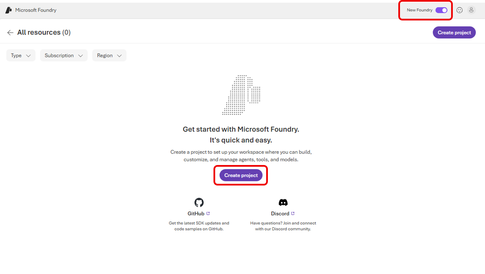
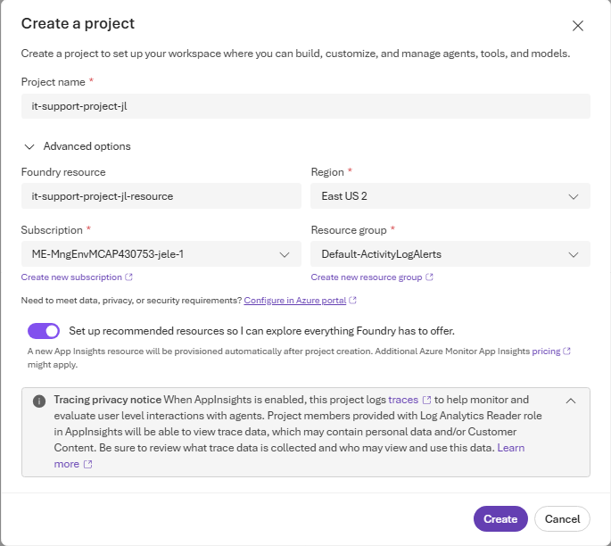
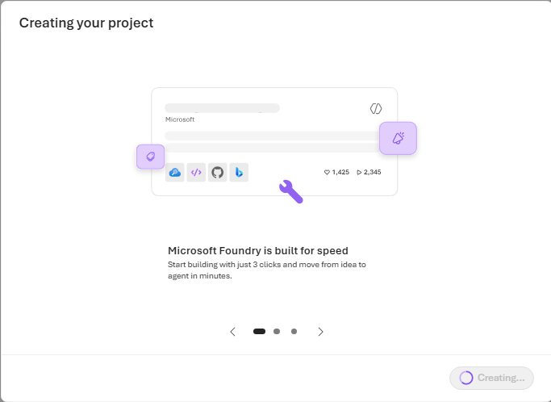
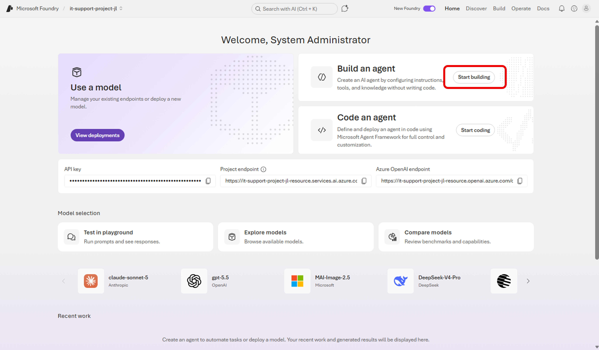
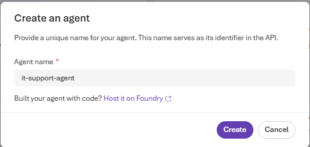

# Step 01. Microsoft Foundry 프로젝트와 에이전트 생성

## 목표
Foundry 포털에서 새 프로젝트를 만들고 기본 에이전트를 생성합니다.

## 실습 순서
1. 브라우저에서 https://ai.azure.com 에 접속해 Azure 계정으로 로그인합니다.

2. 상단 배너에서 "New Foundry"를 사용하는 것으로 설정합니다. "Create project"를 선택하여 새 프로젝트를 만듭니다. 

    

3.  프로젝트 이름(예: it-support-project)을 입력하고, Advanced options에서 아래 항목을 설정합니다.

   - Microsoft Foundry resource: 사용할 리소스 이름 (Foundry resource는 자원 그룹 내에서 고유해야 합니다.)
   - Region: 사용 가능한 지역 (East US 2 혹은 가용 지역 선택)
   - Subscription: 실습에 사용할 구독
   - Resource group: 기존 그룹 선택 또는 새로 생성

- 
    
4. Create를 선택하고 프로젝트 생성이 완료될 때까지 기다립니다.

- 

5. 환영 창이 표시되면 Build an agent 옆의 "Start building"을 클릭하여 에이전트를 생성합니다.

    

6. Agent name을 it-support-agent로 지정하고 에이전트를 생성합니다.

    

## 참고
- 모델/리소스 쿼터에 따라 특정 지역에서 제한이 발생할 수 있습니다. 필요 시 다른 지역으로 다시 생성하세요.

## 다음 단계

* [Step 02. 에이전트 지시문과 그라운딩 데이터 구성](step02.md)

## 실습 순서

* [개요. Build AI Agents with Portal and VS Code](README.md)
* [Step 01. Microsoft Foundry 프로젝트와 에이전트 생성](step01.md)
* [Step 02. 에이전트 지시문과 그라운딩 데이터 구성](step02.md)
* [Step 03. 포털에서 에이전트 테스트](step03.md)
* [Step 04. VS Code에서 에이전트 연결 및 테스트](step04.md)
* [Step 05. 에이전트 연동 클라이언트 애플리케이션 준비](step05.md)
* [Step 06. 환경 구성 후 애플리케이션 실행](step06.md)
* [Step 07. 클라이언트 테스트 및 정리(Cleanup)](step07.md)