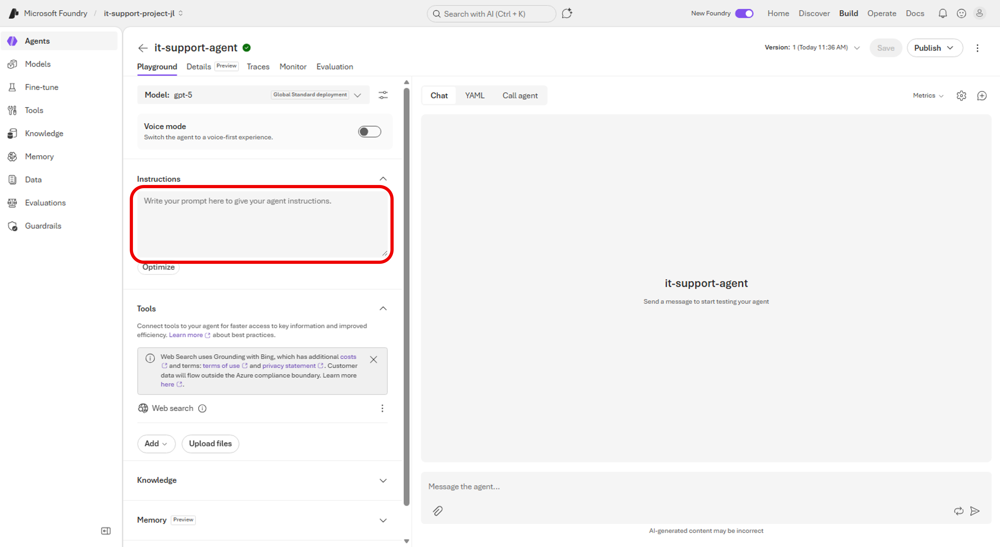
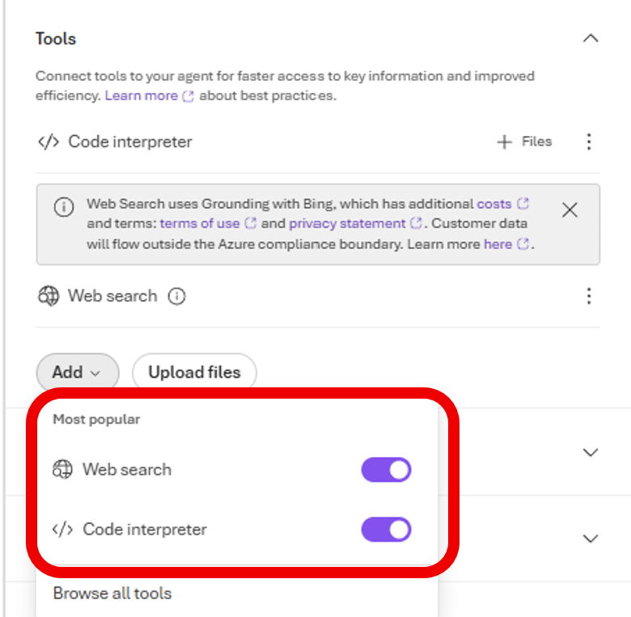
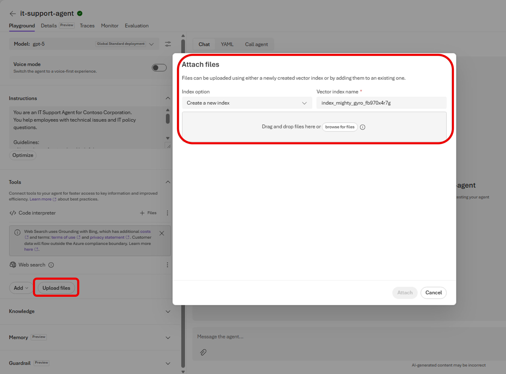
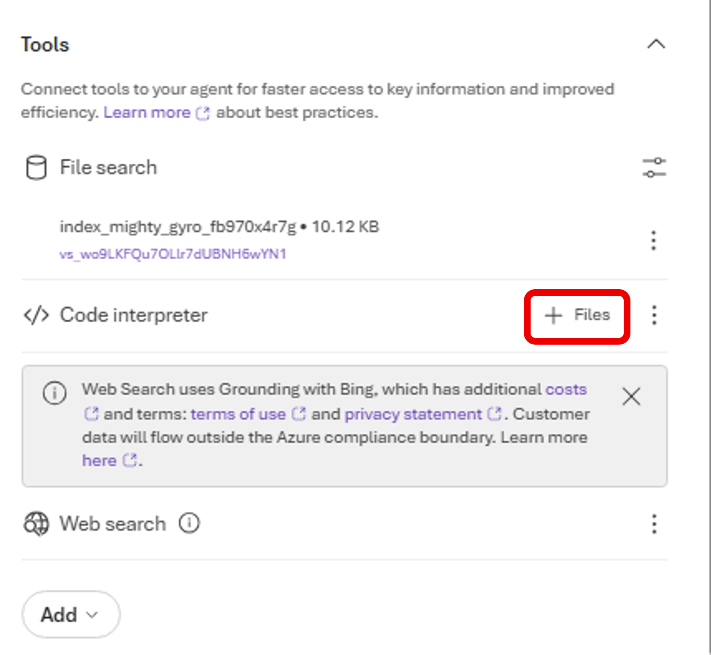
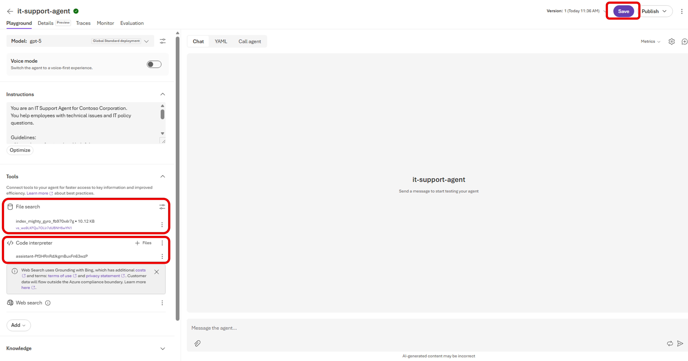

# Step 02. 에이전트 지시문과 그라운딩 데이터 구성

## 목표
에이전트에 역할 지시문을 넣고, 파일 검색 및 코드 인터프리터 도구를 연결합니다.

## 실습 순서
1. 에이전트 플레이그라운드의 Instructions에 아래 내용을 입력합니다.

```text
You are an IT Support Agent for Contoso Corporation.
You help employees with technical issues and IT policy questions.

Guidelines:
- Always be professional and helpful
- Use the IT policy documentation to answer questions accurately
- If you don't know the answer, admit it and suggest contacting IT support directly
- When creating tickets, collect all necessary information before proceeding
```

한국어로 아래와 같이 입력하여도 됩니다.
```text
당신은 Contoso Corporation의 IT 지원 담당자입니다.
 
직원들의 기술적인 문제와 IT 정책 관련 질문에 답변합니다.
 
지침:
- 항상 전문적이고 도움이 되는 태도를 유지하세요.
- IT 정책 문서를 참고하여 질문에 정확하게 답변하세요.
- 답변을 모르는 경우, 모른다고 솔직하게 말하고 IT 지원팀에 직접 문의하도록 안내하세요.
- 티켓을 생성할 때는 필요한 모든 정보를 수집한 후 진행하세요.
```

- 

2. 아래 파일을 다운로드해 로컬에 저장합니다.
   - IT 정책 문서: https://raw.githubusercontent.com/MicrosoftLearning/mslearn-ai-agents/main/Labfiles/01-build-agent-portal-and-vscode/IT_Policy.txt

3. Tools에서 Add를 눌러 File search와 Code interpreter를 추가합니다.

    

4. Upload files(Attach files)에서 IT_Policy.txt를 업로드하고 Attach를 선택합니다.

    

5. 파일 인덱싱 완료 메시지가 나타날 때까지 기다립니다.

6. 아래 성능 데이터 파일을 다운로드해 로컬에 저장합니다.
   - 시스템 성능 CSV: https://raw.githubusercontent.com/MicrosoftLearning/mslearn-ai-agents/main/Labfiles/01-build-agent-portal-and-vscode/system_performance.csv

7. Code interpreter 옆 + Files를 눌러 system_performance.csv를 업로드합니다.

    

8. 에이전트 설정을 저장합니다.

    

## 다음 단계

* [Step 03. 포털에서 에이전트 테스트](step03.md)

## 실습 순서

* [개요. Build AI Agents with Portal and VS Code](README.md)
* [Step 01. Microsoft Foundry 프로젝트와 에이전트 생성](step01.md)
* [Step 02. 에이전트 지시문과 그라운딩 데이터 구성](step02.md)
* [Step 03. 포털에서 에이전트 테스트](step03.md)
* [Step 04. VS Code에서 에이전트 연결 및 테스트](step04.md)
* [Step 05. 에이전트 연동 클라이언트 애플리케이션 준비](step05.md)
* [Step 06. 환경 구성 후 애플리케이션 실행](step06.md)
* [Step 07. 클라이언트 테스트 및 정리(Cleanup)](step07.md)
