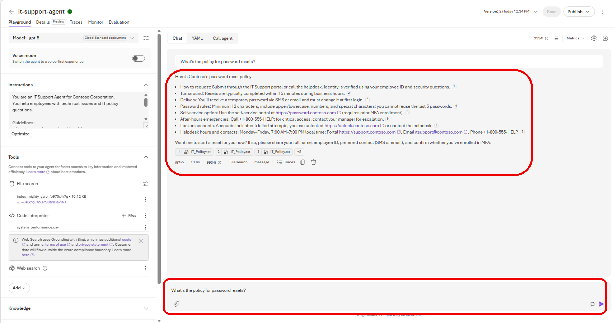
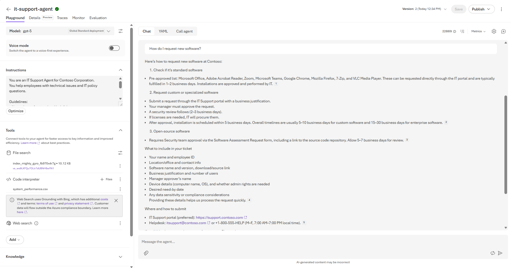
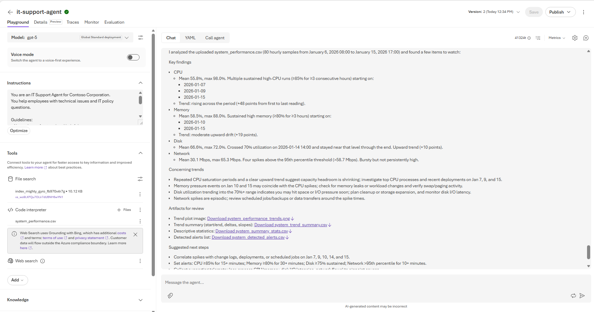
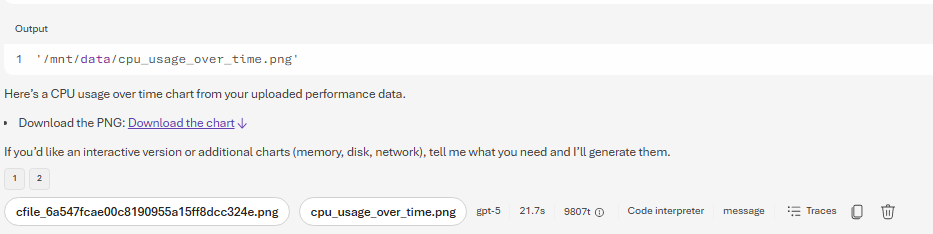

# Step 03. 포털에서 에이전트 테스트

## 목표
업로드한 정책 문서와 성능 데이터가 정상적으로 활용되는지 확인합니다.

## 실습 순서
1. 플레이그라운드 오른쪽 채팅 창에 아래 질문을 입력합니다.

```text
What's the policy for password resets?
```

2. 응답에 IT 정책 문서 기반 답변이 포함되는지 확인합니다.

    

3. 다음 질문을 입력하여 추가로 확인합니다.

```text
How do I request new software?
```

4. 그라운딩 데이터 활용 여부를 다시 확인합니다.

    

5. 다음 질문을 입력하여 코드 인터프리터 분석을 테스트합니다.

```text
Can you analyze the system performance data and tell me if there are any concerning trends?
```

6. CSV 분석 결과가 요약/인사이트 형태로 나오는지 확인합니다.

    

7. 시각화 요청을 테스트합니다.

```text
Create a chart showing CPU usage over time from the performance data
```

8. 차트/시각화 생성이 정상 수행되는지 확인합니다.

    

## 다음 단계

* [Step 04. VS Code에서 에이전트 연결 및 테스트](step04.md)

## 실습 순서

* [개요. Build AI Agents with Portal and VS Code](README.md)
* [Step 01. Microsoft Foundry 프로젝트와 에이전트 생성](step01.md)
* [Step 02. 에이전트 지시문과 그라운딩 데이터 구성](step02.md)
* [Step 03. 포털에서 에이전트 테스트](step03.md)
* [Step 04. VS Code에서 에이전트 연결 및 테스트](step04.md)
* [Step 05. 에이전트 연동 클라이언트 애플리케이션 준비](step05.md)
* [Step 06. 환경 구성 후 애플리케이션 실행](step06.md)
* [Step 07. 클라이언트 테스트 및 정리(Cleanup)](step07.md)