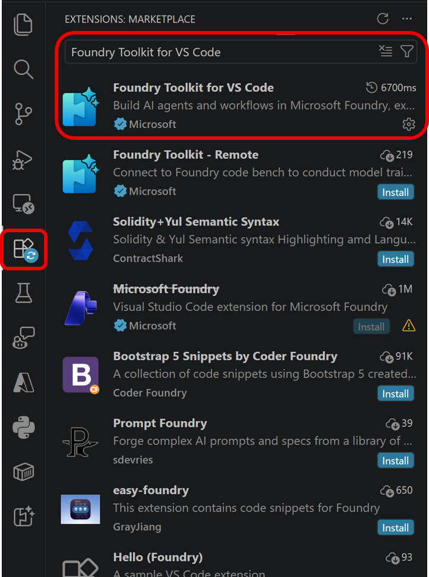
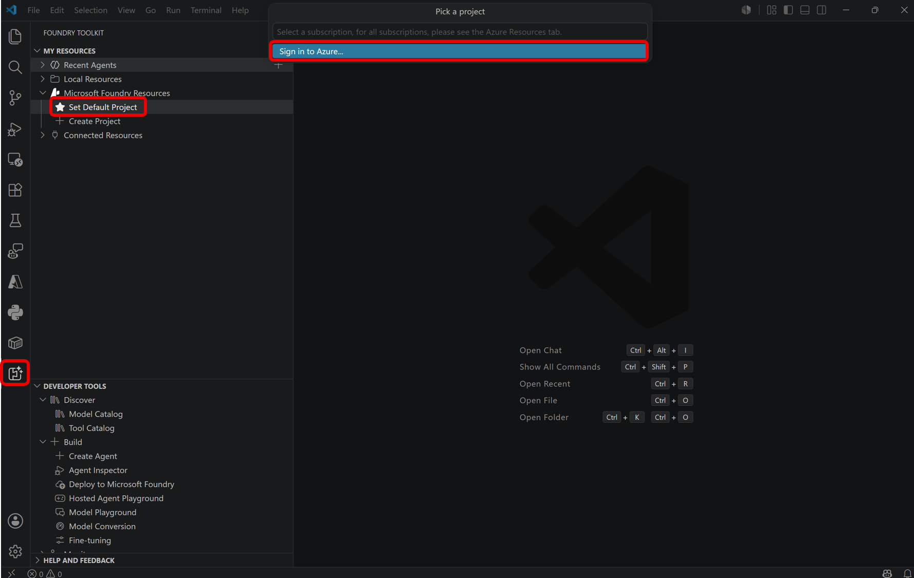
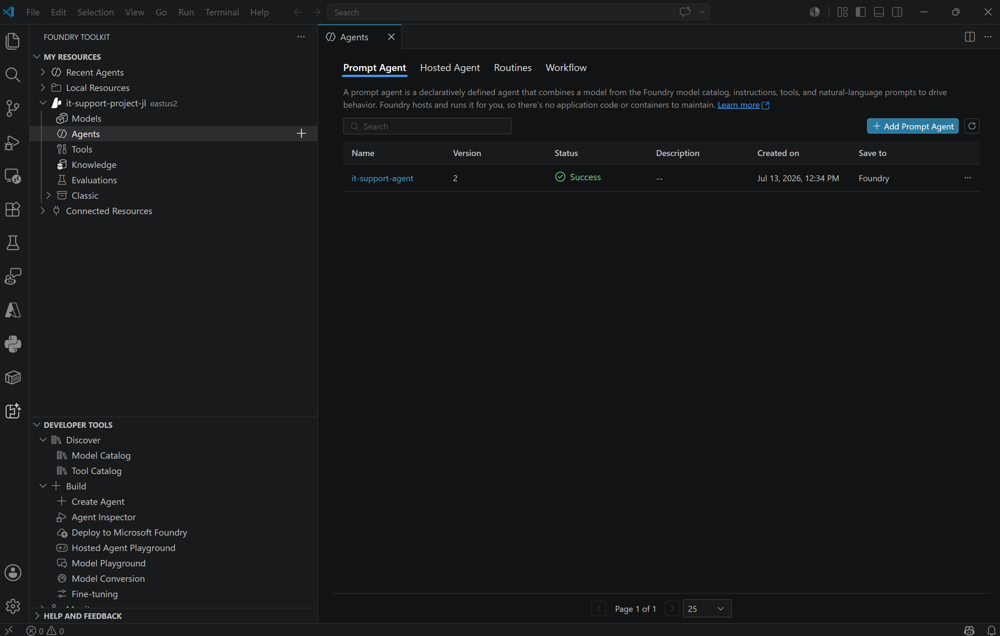

# Step 04. VS Code에서 에이전트 연결 및 테스트

## 목표
Foundry Toolkit 확장에서 포털에서 만든 에이전트를 열어 VS Code 내부에서 테스트합니다.

## 실습 순서
1. Visual Studio Code를 실행합니다.
2. Extensions(Ctrl+Shift+X)에서 Foundry Toolkit for VS Code(Microsoft)를 설치합니다.

    

3. 사이드바의 Foundry Toolkit 아이콘을 열고, Microsoft Foundry Resources에서 Set Default Project를 선택해 기본 프로젝트를 지정합니다. Azure 계정으로 로그인이 되어있지 않을 경우 로그인 합니다.

    

4. 프로젝트를 펼친 뒤 Prompt Agents에서 it-support-agent를 선택해 Agent Builder를 엽니다.

    

6. 플레이그라운드 채팅에서 아래 질문을 입력해 이전 단계에서 업로드한 IT Policy 파일들의 그라운딩 데이터를 사용하여 응답을 하는 것을 확인합니다.

```text
What is the policy for reporting a lost or stolen device?
```

## 다음 단계

* [Step 05. 에이전트 연동 클라이언트 애플리케이션 준비](step05.md)

## 실습 순서

* [개요. Build AI Agents with Portal and VS Code](README.md)
* [Step 01. Microsoft Foundry 프로젝트와 에이전트 생성](step01.md)
* [Step 02. 에이전트 지시문과 그라운딩 데이터 구성](step02.md)
* [Step 03. 포털에서 에이전트 테스트](step03.md)
* [Step 04. VS Code에서 에이전트 연결 및 테스트](step04.md)
* [Step 05. 에이전트 연동 클라이언트 애플리케이션 준비](step05.md)
* [Step 06. 환경 구성 후 애플리케이션 실행](step06.md)
* [Step 07. 클라이언트 테스트 및 정리(Cleanup)](step07.md)