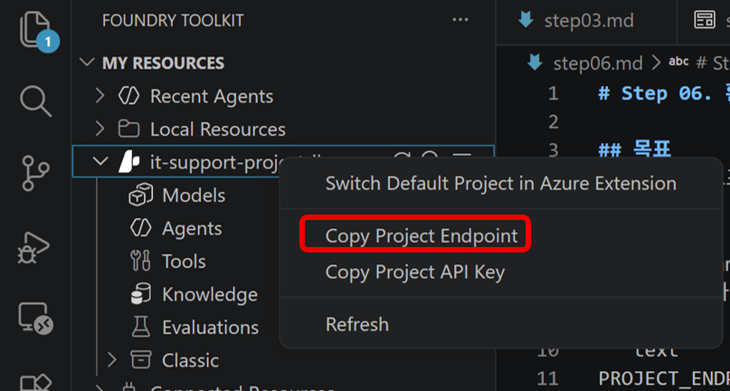

# Step 06. 환경 구성 후 애플리케이션 실행

## 목표
프로젝트 엔드포인트를 설정하고 가상환경/의존성을 준비한 뒤 앱을 실행합니다.

## 실습 순서
1. .env.example 파일을 복제하여 .env 파일로 이름을 바꿉니다.
2. .env에 아래 값을 설정합니다.

```text
PROJECT_ENDPOINT=<your_project_endpoint>
AGENT_NAME=it-support-agent
```

3. PROJECT_ENDPOINT는 Foundry Toolkit에서 활성 프로젝트 우클릭 후 Copy Endpoint로 가져옵니다.
   - 해당 메뉴가 없으면 Foundry 포털 프로젝트 개요에서 엔드포인트를 복사합니다.

    

4. VS Code에서 터미널을 열고 실습 폴더로 이동합니다.

5. 가상환경 생성 및 패키지 설치를 진행합니다.

```powershell
python -m venv labenv
.\labenv\Scripts\Activate.ps1
pip install -r requirements.txt
```

6. Azure 로그인합니다.

```powershell
az login
```

7. 애플리케이션을 실행합니다.

```powershell
python agent_with_functions.py
```

## 다음 단계

* [Step 07. 클라이언트 테스트 및 정리(Cleanup)](step07.md)

## 실습 순서

* [개요. Build AI Agents with Portal and VS Code](README.md)
* [Step 01. Microsoft Foundry 프로젝트와 에이전트 생성](step01.md)
* [Step 02. 에이전트 지시문과 그라운딩 데이터 구성](step02.md)
* [Step 03. 포털에서 에이전트 테스트](step03.md)
* [Step 04. VS Code에서 에이전트 연결 및 테스트](step04.md)
* [Step 05. 에이전트 연동 클라이언트 애플리케이션 준비](step05.md)
* [Step 06. 환경 구성 후 애플리케이션 실행](step06.md)
* [Step 07. 클라이언트 테스트 및 정리(Cleanup)](step07.md)